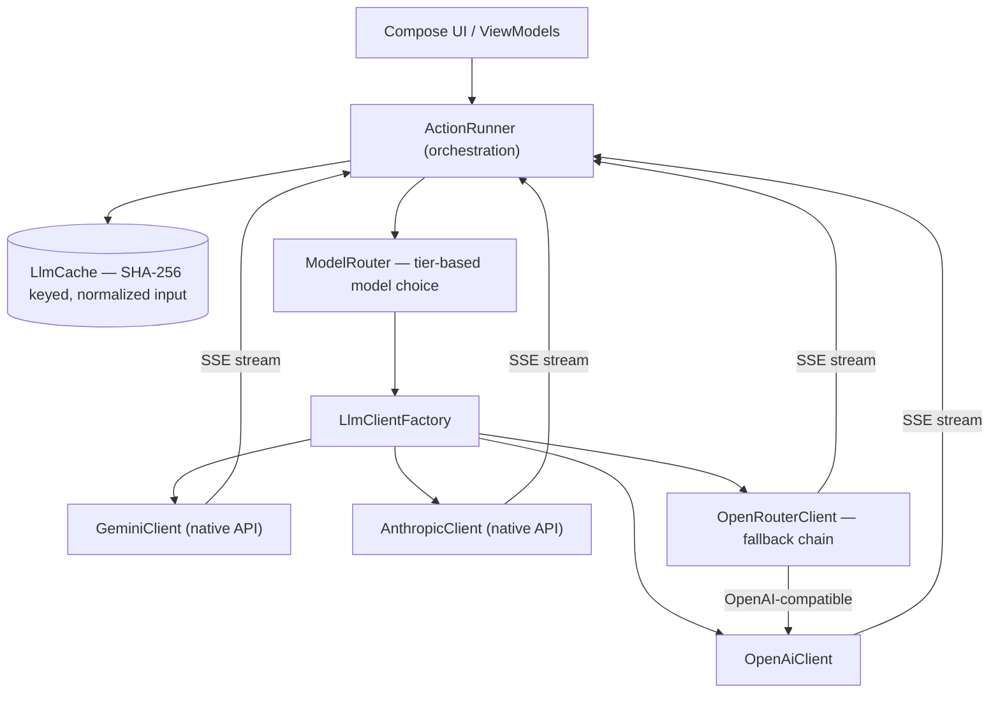

# LangoClip

**A floating-bubble English tutor for Android.** Tap the always-on-top bubble from any app, drop in
English text from your clipboard, and get an instant idiomatic translation, a grammatical breakdown
of the sentence, per-word meanings, usage examples, and an interactive tutor chat — streamed token
by token from your choice of LLM provider.


> Built as a personal language-learning tool and an engineering showcase: a clean multi-provider LLM
> layer (Gemini · OpenAI · Anthropic · OpenRouter) with streaming, automatic fallback, tier-based
> model routing, structured output, and response caching — all behind one interface.

## Screenshots

> _Add screenshots / a short demo GIF to `docs/` and link them here — e.g. bubble overlay, sentence
> breakdown, tutor chat._

| Bubble overlay | Sentence breakdown | Tutor chat |
| :---: | :---: | :---: |
| _docs/bubble.png_ | _docs/breakdown.png_ | _docs/tutor.png_ |

## Features

- **Floating bubble overlay** — a draggable chathead drawn over other apps via `WindowManager`,
  kept alive by a `specialUse` foreground service.
- **One-tap clipboard capture** — tapping the bubble brings the activity forward and auto-reads the
  clipboard (worked around Android 10+ background-clipboard restrictions).
- **Idiomatic translation** — streamed, not literal.
- **Sentence breakdown** — tense constructions, idioms, phrasal verbs and per-word parts of speech,
  parsed and rendered incrementally as the model streams JSON.
- **Word meanings & usage examples** — enriched with a free dictionary API and a bundled offline
  lemma/example SQLite database.
- **Interactive tutor chat** — multi-turn, corrects your sentences and explains nuance.
- **Bring your own model** — switch between Gemini, OpenAI (ChatGPT), Anthropic (Claude) and
  OpenRouter; works out of the box on OpenRouter's free tier with no key.
- **Full i18n** — English base strings with a complete Polish localization.

## Architecture

The interesting part is the LLM layer: every provider sits behind a single `LlmClient` interface,
so the UI never knows which backend answered. Tasks are routed to a cheap/fast or a capable model by
**tier**, responses are **streamed** (SSE) and **cached**, and OpenRouter adds an automatic
**fallback chain** across models on quota errors or slow first-token times.



**Request flow:** UI action → `ActionRunner` checks the cache → `ModelRouter` picks the model for
the task tier → `LlmClientFactory` builds the provider client → the response streams back token by
token → structured responses are parsed incrementally and the result is cached after a successful
parse.

## Tech stack

| Area | Choice |
| --- | --- |
| Language | Kotlin 2.2 |
| UI | Jetpack Compose + Material 3 (dynamic color) |
| Networking | Ktor client + kotlinx.serialization, SSE streaming |
| Persistence | Room (cache + offline lemma/example DBs), DataStore (settings) |
| Security | EncryptedSharedPreferences (AES-256) for API keys |
| Async | Coroutines + Flow |
| Build | Gradle (AGP 9), version catalog, KSP |
| Min / target SDK | 26 / 35 |

## Engineering highlights

- **Provider-agnostic LLM abstraction** — one `LlmClient` interface; Gemini and Anthropic use their
  native protocols, OpenAI and OpenRouter share an OpenAI-compatible client.
- **Tier-based routing** — `LlmTask → ModelTier` sends cheap tasks (translate, word senses) to a
  fast/Lite model and nuanced tasks (chat, breakdown) to a capable model.
- **Fallback chain** — `OpenRouterClient` walks an ordered candidate list on HTTP 402/429 or a
  time-to-first-token timeout, with live routing state surfaced in the UI.
- **Incremental streaming parse** — JSON arrays are parsed as they arrive so breakdown items render
  one by one instead of after the full response.
- **Cross-provider structured output** — one Gemini-format JSON schema is converted on the fly to
  OpenAI-strict and Anthropic shapes (`SchemaConverter`).
- **Cache-aside with aggressive key normalization** — `"She runs."`, `"  she runs!  "` and
  `"SHE RUNS?"` all hit the same cached response.
- **Internationalization** — English source, all user-facing text in resources, full `values-pl`.

## Build & run

```bash
# Android Studio: open the project root and let it sync.
# Or from the CLI:
./gradlew :app:installDebug      # build + install on a connected device/emulator
./gradlew :app:assembleDebug     # APK -> app/build/outputs/apk/debug/
```

No API key is required to start — the app defaults to OpenRouter's free tier. To use your own
provider/key, open **Settings** in-app. (Local default keys can be supplied via `local.properties`
or `app/.env`; both are gitignored and never committed.)

On first launch, enable the floating icon — Android will request the *Display over other apps*
permission (and notifications on Android 13+).

## Testing

```bash
./gradlew :app:testDebugUnitTest
```

Pure-JVM unit tests cover the logic worth pinning: tier→model routing, OpenRouter candidate
ordering, cache-key normalization, and cross-provider schema conversion.

## Project layout

```
app/src/main/kotlin/com/langoclip/app/
├── MainActivity.kt          # Compose UI host, clipboard read on resume
├── BubbleService.kt         # Foreground service + WindowManager overlay
├── BubbleTouchListener.kt   # Drag vs click detection
├── llm/                     # LlmClient interface, per-provider clients, routing, schema
├── actions/                 # ActionRunner orchestration, prompts
├── data/                    # Settings, cache, Room DBs, providers
├── translation/ · chat/ · local/
└── ui/                      # Compose screens, ViewModels, theme
```

## Roadmap

- Localize domain-layer error messages (currently English in place).
- Snap-to-edge + persisted bubble position (DataStore).
- `dp → px` bubble positioning for consistent placement across screen densities.
- Robolectric coverage for the touch-listener drag/click thresholds.

## License

[MIT](LICENSE) © 2026 Adam Skowronek
